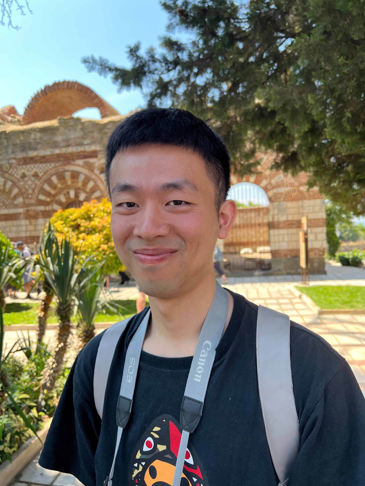

  

>
>*A control theorist's first instinct in the face of a new problem is to find a way to use the tools he knows, rather that a commitment to understand the underlying phenomenon. This is not the failure of individuals but the failure of our profession to foster the development of experimental control science. In a way, we have become the prisoners of our rich inheritance and past successes.*                                                                                                                                   
>
><cite>Yuchi Ho</cite>

Hi there, it's Junning. I'm doing my PhD in [IAS](https://www.ias.informatik.tu-darmstadt.de/) , TU Darmstadt. My current research interest is to go beyond the classic conservative model-based control theoretic approaches, build up state estimators and controllers that 

- Satisfies certain performance or safety criteria, go beyond asymptotical stability;
- Deal with nonlinear, hybrid, non-smooth, contact dynamics;
- Utilize the advantages of both causal and non-causal control perspective;

with modern geometry, optimization and machine learning tools. The ultimate goal here is to automate daily processes in a robust and safely manner and performing intelligent decision making to assist humans.

My journey of research starts at [Sensetime](https://www.sensetime.com/en), where I was doing reinforcement learning, inverse reinforcement learning. The topics include theoretical one: exploration-exploitation dilemma and application for decision making in autonomous driving. Though the research problems are interesting and my mentors are really nice, I did not learn how to properly do research and didn't find the problem that really triggers me. It was a nice experience though because I learnt one key principle from my mentor in learning everything: be honest to yourself.

After getting a bit tired of the machine learning community, and the inflation of the reinforcement learning community (to be honest now I don't think this should be the reason to give up a field, but I was too naive back in the days), I switched more physical oriented robotics field. Instead of the classic trial and error more engineering mind set,  I devote myself all into the control theory community, think that with rigorous math and clean definitions would produce the applications with theoretical guarantees, which turned out I was completely wrong and put me in a very dangerous position of not getting anywhere. The biggest mistake that I made is I owe my failure on the research problem to the lack of good tools and I always 

After all those seeking, I figured that my understanding of research back in the days is very naive. Researchers should fully commit to the problem instead of commit to your rigid knowledge, should not always try to seek the solutions from papers first before you think of it, you guess it yourself, should not give up without you try your best to do it, should not try to escape the problem with some theories. Both theory and experiments should be your tools because we are doing fundamental engineering research. 

